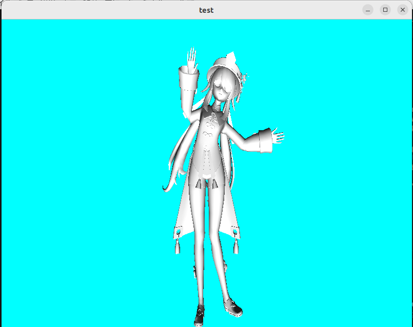

# ufbx-and-glfw
This is a program that displays FBX files using ufbx, OpenGL, GLFW, and GLAD.
## Version Information

The following library versions were used in this project:

- **GLFW:** 3.3.6  
- **OpenGL:** 4.6 (Mesa 23.2.1)  
- **GLAD:** Generated for OpenGL 4.6 <https://glad.dav1d.de/>
- **ufbx:** Current latest version <https://github.com/ufbx/ufbx.git>

## Known Limitations and Notes

- **Skinned Meshes:** Supported for rendering in a static/bind pose. **Rigged animation playback is not yet supported.**
- **No-Animation Case:** Projects without animation clips can **glitch** with the current pipeline.  
  Please adjust your shaders / update loop to:
  - Use identity matrices for missing bones,
  - Bypass skinning updates when there are no active animations,
  - Add null checks for empty animation data.
- **Shape Keys (Morph Targets):** Currently **unsupported**.
## FBX SDK

The Autodesk FBX SDK could technically be used,  
but it was avoided because it is relatively slow and difficult to work with.  
Instead, this project uses **ufbx**, a lightweight and faster FBX loader.

# Example test image

# End Comments
That’s about it for now — maybe I’ll add animation someday if I get the time.
